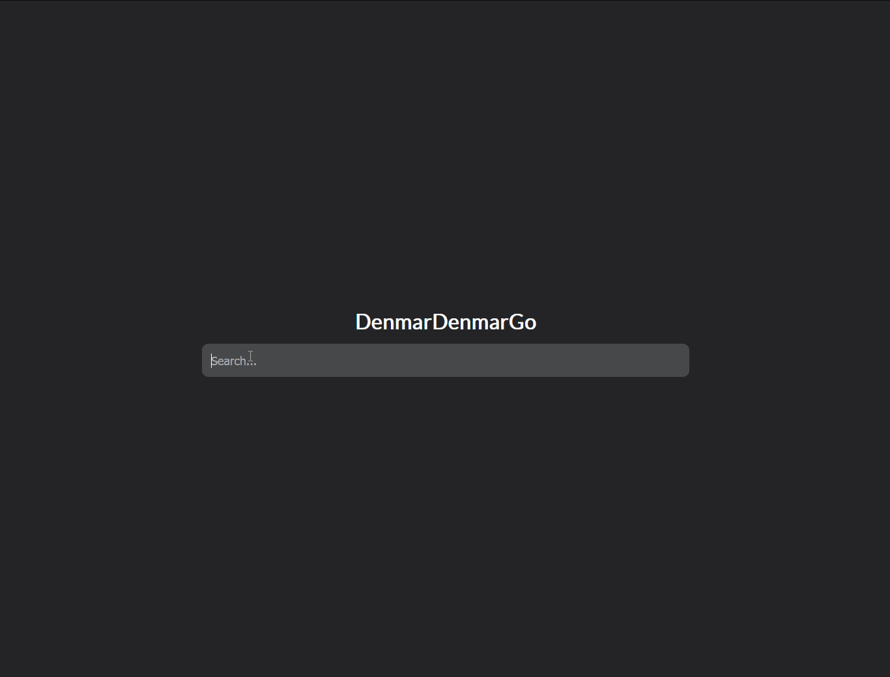

# SearchEngine

A web application demonstrating a search engine I built that uses ranked retrieval to return relevant queries pertaining to Computer Science at the University of California, Irvine. 

### Why are there two versions?
- For grading Milestone 3 of this assignment, only look at version2.
Version 1 was created during Milestone 1 & 2 of this assignment. The inverted index used in Version 1 is slow to obtain postings from. For Milestone 3, I created a new version of this project which obtains Postings from the inverted index at constant time which allows for faster query times.

### Structure of Given Data
Main Directory ('ANALYST' or 'DEV')
- Domain Name
    - json file
        - url
        - content
        - encoding
